# Trees and Graphs

## Trees
We'll discuss trees first and then graphs, even though trees are really just a type of graph

### Types of Trees

A nice way to understand a tree is with a recursive explanation. A tree is a data structure composed of nodes.

- Each tree has a root node.
- The root node has zero or more child nodes.
- Each child node has zero or more childe nodes, and so on.

A tree cannot contain cycles. The nodes may or may not be in a particular order, they could have any data type as values, and they may or may not have links back to their parent nodes.

A very simple class definition for `Node` is:


```python
class Node:
    def __init__(self, name):
        self.name = name
        self.children = list()
```

You might also have a `Tree` class to wrap this node.


```python
class Tree:
    def __init__(self, root):
        self.root: Node = root
```

#### Trees vs. Binary Trees

A binary tree is a tree in which each node has up to two children. Not all trees are binary trees. For example, this tree is not a binary tree. You could call it a ternary tree.

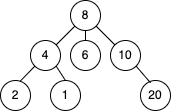

There are occasions when you might have a tree that is not a binary tree. For example, suppose you were using a tree to represent a bunch of phone numbers. In this case, you might use a 10-ary tree, with each node having up to 10 children (one for each digit).

A node is called a "leaf" node if it has no children.

#### Binary Tree vs Binary Search Tree

A binary search tree is a binary tree in which every node fits a specific ordering property: **all left descendents <= n < all right descendents**. This must be true for each node n.

Note that this inequality must be true for all of a node's descendents, not just its immediate children.

A binary search tree:

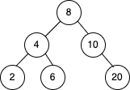

Not a binary search tree:

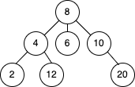

A binary search tree imposes the condition that, for each node, its left descendents are less than or equal to the current node, which is less than the right descendents.

#### Balanced vs. Unbalanced

While many trees are balanced, not all are. Note that balancing a tree does not mean the left and right subtrees are exactly the same size (like you see under "perfect binary trees" below).

One way to think about it is that a "balanced" tree really means something more like "not terribly imbalanced". It's balanced enought to ensure `O(log n)` times for `insert` and `find`, but it's not necessarily as balanced as it could be.

#### Complete Binary Trees

A complete binary tree is a binary tree in which every level of the tree is fully filled, except for perhaps the last level. To the extent that the last level is filled, it is filled left to right.

Not a complete binary tree:

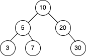

A complete binary tree:


#### Full Binary Trees

A full binary tree is a binary tree in which every node has either zero or two children. That is, no nodes have only one child.

Not a full binary tree:

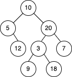

A full binary tree:

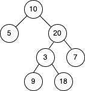

#### Perfect Binary Trees

A perfect binary tree is one that is both full and complete. All leaf nodes will be at the same level, and the level has the maximum number of nodes.

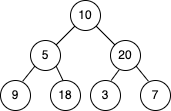

Note that perfect trees are rare, as a perfect tree must have exactly $2^k - 1$ nodes (where $k$ is the number of levels).


### Binary Tree Traversal

#### In-Order Traversal

In-order traversal means to "visit" (often, print) the left branch, then the current node, then the right branch.

```python
def in_order_traversal(node):
  if node is not None:
    in_order_traversal(node.left)
    visit(node)
    in_order_traversal(node.right)
```

When performed on a binary search tree, it visits the nodes in ascending order (hence the name "in-order").

#### Pre-Order Traversal

Pre-order traversal visits the current node before its child nodes (hence the name "pre-order").

```python
def in_order_traversal(node):
  if node is not None:
    visit(node)
    in_order_traversal(node.left)
    in_order_traversal(node.right)
```

In a pre-order traversal, the root is always the first node visited.

#### Post-Order Traversal

Post-order traversal visits the current node after its child nodes (hence the name "post-order").

```python
def in_order_traversal(node):
  if node is not None:
    in_order_traversal(node.left)
    in_order_traversal(node.right)
    visit(node)
```

In a post-order traversal, the root is always the last node visited.

### Binary Heaps (Min-Heaps and Max-Heaps)

We'll only discuss min-heaps here. Max-heaps are essentially equivalent, but the elements are in descending order rather than ascending order.

A min-heap is a _complete_ binary tree (that is, totally filled other than the rightmost elements on the last level) where each node is smaller than its children. The root, therefore, it the minimum element in the tree.

For example:

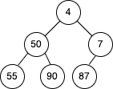

We have two key operations on a min-heap: `insert` and `extract_min`.

`Insert`

When we insert into a min-heap, we always start by inserting the element at the bottom. We insert at the rightmost spot so as to maintain the complete tree property.

Then, we "fix" the tree by swapping the new element with its parent, until we find an appropriate spot for the element. We essentially bubble up the minimum element.

- Step 1: Insert 2


- Step 2: Swap 2 and 7


- Step 3: Swap 2 and 4


This take `O(log n)` time, where `n` is the number of nodes in the heap.

`Extract Minimum Element`

Finding the minimum element of a min-heap is easy: it's always at the top. The trickier part is how to remove it (in fact, this isn't that tricky).

First, we remove the minimum element and swap it with the last element in the heap (the bottommost rightnost element). Then, we bubble down this element, swapping it with one of its children until the min-heap property is restored.

Do we swap it with the left child or the right child? This depends on their values. There's no inherent ordering between the left and right element, but you'll need to take the smaller one in order to maintain the min-heap ordering.

- Step 1: Replace min with 80

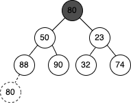

- Step 2: Swap 23 and 80

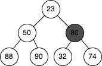

- Step 3: Swap 32 and 80

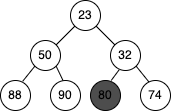

This algorithm will take `O(log n)` time.

### Tries (Prefix Trees)

A trie (sometimes called a prefix tree) is a funny data structure. A trie is a variant of an n-ary tree in which characters are stored at each node. Each path down the tree may represent a word.

The `*` nodes (sometimes called "null nodes") are often used to indicate complete words. For example, the fact that there is a `*` node under `MANY` indicates that `MANY` is a complete word. The existence of the `MA` path indicates there are words that start with `MA`.

The actual implementation of these `*` nodes might be a special type of child (such as a `TerminatingTrieNode`, which inherits from `TrieNode`). Or, we could use just a boolean flat `terminates` within the "parent" node.

A node in a trie could have anywhere from `0` to `ALPHABET_SIZE + 1` children.

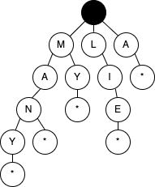

Very commonly, a trie us used to store the entire (English) language for quick prefix lookups. While a hash table can quickly look up where a string is a valid word, it cannot tell us if a string is a prefix of any valid words. A trie can do this very quickly.

How quickly? A trie can check is a string is a valid prefix in `O(K)` time, where `K` is the length of the string. This is actually the same runtime as a hash table will take. Although we often refer to has table lookups as being `O(1)` time, this isn't entirely true. A hash table must read through all the characters in the input, which take `O(K)` time in the case of a word lookup.

Many problems involving lists of valid words leverage a trie as an optimization. In situations when we search through the tree on related prefixes repeatedly (e.g., looking up `M`, then `MA`, then `MAN`, the `MANY`), we might pass around a reference to the current node in the tree. This will allow us to just check if `Y` is a child of `MAN`, rather than starting from the root each time.

## Graphs
TODO


```python
def create_md_of_notebook():
    !jupyter nbconvert ./trees_and_graphs.ipynb --to markdown

create_md_of_notebook()
```


```python

```
